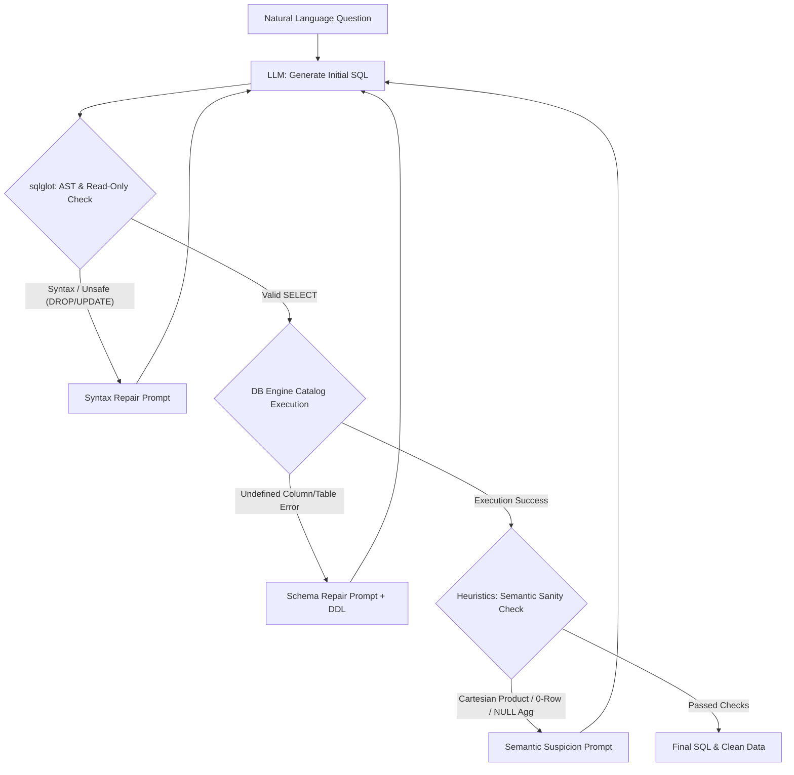

# Self-Correcting Text-to-SQL Engine with Typed Repair Policy

A production-grade Text-to-SQL engine with a stateful LLM orchestration loop, AST security guardrails via `sqlglot`, intentional database schema messiness, and a **Typed Repair Policy** that classifies and repairs three distinct failure modes: **Syntax Errors**, **Schema Mismatches**, and **Semantic Suspicion**.

---

## 🌟 Key Features & Architecture

Most naive Text-to-SQL systems stop at zero-shot prompt generation or feed generic "Fix this" errors back to the LLM. In real enterprise environments, queries can be syntactically valid and execute cleanly, yet return completely wrong results (e.g. Cartesian products inflating revenues or overly restrictive WHERE clauses silently returning 0 rows).

This engine implements a **Deterministic State Machine Orchestration Loop** with specialized gates:



---

## 🛠 Typed Repair Policy

| Failure Class | Detection Mechanism | Repair Context Provided to LLM |
| :--- | :--- | :--- |
| **Syntax Error** | `sqlglot` AST parser & Read-Only Guardrails | Malformed SQL + `sqlglot` parser diagnostic / dialect rules |
| **Schema Error** | PostgreSQL DB Engine (`psycopg2.errors.UndefinedColumn`) | Invalid SQL + DB Error + Full Database Catalog DDL |
| **Semantic Error** | Result set heuristics (Cartesian product, 0-row, NULL agg) | Valid SQL + Suspicion Reason + First 3 sample rows |

---

## 🗄 Intentional Schema Messiness

The database (`ecommerce_messy`) contains 3 tables with real-world edge cases:
- **`customers`**: Primary key is `customer_id` (not `id`). `region` column is nullable.
- **`orders`**: Uses `cust_id` as foreign key (mismatch with `customer_id`). Contains denormalized `total_amount`.
- **`line_items`**: Granular product line items (`qty`, `unit_price`).
- **Data Volume**: 120 customers, 600 orders, and 1800 line items to ensure Cartesian products blow up the row count (>1000 rows).

---

## 🚀 Quickstart with Docker Compose

### 1. Prerequisites
- Docker & Docker Compose installed.

### 2. Environment Setup
Copy `.env.example` to `.env` and insert your OpenAI API Key:
```bash
cp .env.example .env
```
Environment variables:
```env
OPENAI_API_KEY=your_openai_api_key_here
LLM_MODEL=gpt-4o-mini
DB_HOST=db
DB_PORT=5432
DB_USER=postgres
DB_PASSWORD=postgres
DB_NAME=ecommerce_messy
```

### 3. Build & Run Containerized Application
```bash
docker compose up -d --build
```

Verify services are healthy:
```bash
docker compose ps
```

The API service is accessible at `http://localhost:8000`. Swagger documentation is available at `http://localhost:8000/docs`.

---

## 📡 API Usage

### Endpoint: `POST /api/query`

#### Request Payload:
```json
{
  "question": "Show me the top 5 spenders among all customers"
}
```

#### Response (200 OK):
```json
{
  "status": "success",
  "final_sql": "SELECT c.customer_id, c.name, SUM(o.total_amount) AS total_spent FROM customers c JOIN orders o ON c.customer_id = o.cust_id GROUP BY c.customer_id, c.name ORDER BY total_spent DESC LIMIT 5;",
  "results": [
    {
      "customer_id": 42,
      "name": "Customer 42",
      "total_spent": 2450.75
    }
  ],
  "iterations": 1,
  "repair_history": []
}
```

---

## 📊 Evaluation & Metrics

The repository includes a 30-question test suite (`data/eval_set.json`) and a batch evaluation runner (`scripts/evaluate.py`) comparing 3 pipeline configurations:
1. `zero_shot`: Generate initial SQL and attempt execution once.
2. `syntax_schema_repair_only`: Enable repair loop for AST parse errors & DB engine errors only.
3. `full_pipeline`: Full Typed Repair Policy with AST, Schema, and Semantic Sanity checks.

Run evaluation:
```bash
python scripts/evaluate.py
```

Output metrics are stored in `results/evaluation_metrics.json`.

---

## 🧪 Unit Testing

Run test suite:
```bash
pytest tests/ -v
```

---

## 📁 Repository Structure

```
project_root/
├── src/
│   ├── __init__.py
│   ├── agent.py            # Orchestrator & Typed Repair Loop state machine
│   ├── db.py               # Database connection & catalog extraction wrapper
│   ├── guardrails.py       # sqlglot parsing logic & AST read-only guardrails
│   ├── heuristics.py       # Semantic sanity checks (Cartesian product, 0-row, NULL agg)
│   └── prompts.py          # Prompt templates for the 3 typed repair paths
├── scripts/
│   ├── seed_db.sql         # Database creation & seeding script (120 cust, 600 orders, 1800 items)
│   └── evaluate.py         # Batch runner comparing 3 pipeline configurations
├── api/
│   └── main.py             # FastAPI REST endpoint (/api/query & /health)
├── data/
│   └── eval_set.json       # 30 NL questions with gold SQL standards
├── results/
│   └── evaluation_metrics.json # Metric output generated by evaluate.py
├── tests/                  # Unit tests for guardrails, heuristics, DB, & agent
├── docker-compose.yml      # Starts PostgreSQL and FastAPI containers
├── Dockerfile              # Container image for FastAPI app
├── .env.example            # Environment variables configuration template
├── requirements.txt        # Python dependencies
└── README.md
```
